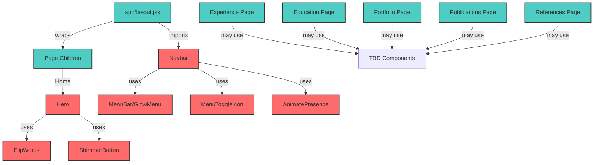

# Data Model: Component & Page Inventory

**Date**: November 26, 2025  
**Feature**: [spec.md](./spec.md) | [plan.md](./plan.md) | [research.md](./research.md)  
**Status**: Complete

## Overview

This document provides a comprehensive inventory of all pages, components, and their relationships in the Vite to Next.js migration. It defines which components require the `'use client'` directive and documents their dependencies, props, and state management.

---

## Page Components

### 1. Home Page

**Current Location**: `src/pages/Home.jsx`  
**Target Location**: `app/page.jsx`  
**Component Type**: Server Component (default)

**Description**: Landing page displaying the Hero component

**Structure**:

```jsx
// Server Component (no directive needed)
import Hero from "@/components/Hero";

export default function Home() {
  return (
    <div className="min-h-screen flex items-center justify-center">
      <Hero />
    </div>
  );
}
```

**Dependencies**:

- Hero component (Client Component)

**State**: None

**Props**: None

---

### 2. Experience Page

**Current Location**: `src/pages/Experience.jsx`  
**Target Location**: `app/experience/page.jsx`  
**Component Type**: Server Component (default)

**Description**: Professional experience timeline/listing

**Dependencies**: TBD (content not examined)

**State**: Likely none (static content)

---

### 3. Education Page

**Current Location**: `src/pages/Education.jsx`  
**Target Location**: `app/education/page.jsx`  
**Component Type**: Server Component (default)

**Description**: Educational background and qualifications

**Dependencies**: TBD (content not examined)

**State**: Likely none (static content)

---

### 4. Portfolio Page

**Current Location**: `src/pages/Portfolio.jsx`  
**Target Location**: `app/portfolio/page.jsx`  
**Component Type**: Server Component (unless interactive filtering)

**Description**: Project showcase and portfolio items

**Dependencies**: TBD (content not examined)

**State**: May have filtering/sorting state (check implementation)

**Note**: If interactive (filters, search, etc.), may need Client Component sections

---

### 5. Publications Page

**Current Location**: `src/pages/Publications.jsx`  
**Target Location**: `app/publications/page.jsx`  
**Component Type**: Server Component (default)

**Description**: Academic publications and research papers

**Dependencies**: TBD (content not examined)

**State**: Likely none (static content)

---

### 6. References Page

**Current Location**: `src/pages/References.jsx`  
**Target Location**: `app/references/page.jsx`  
**Component Type**: Server Component (default)

**Description**: Professional references and testimonials

**Dependencies**: TBD (content not examined)

**State**: Likely none (static content)

---

## Layout Components

### Root Layout

**Current Location**: `src/App.jsx` (routing logic)  
**Target Location**: `app/layout.jsx`  
**Component Type**: Server Component (default)

**Description**: Root layout wrapping all pages with Navbar and global styles

**Structure**:

```jsx
// Server Component (no directive needed)
import Navbar from "@/components/Navbar";
import "./globals.css";
import { Poppins } from "next/font/google";

const poppins = Poppins({
  subsets: ["latin"],
  weight: ["100", "200", "300", "400", "500", "600", "700", "800", "900"],
  style: ["normal", "italic"],
  display: "swap",
  variable: "--font-poppins",
});

export const metadata = {
  title: "Viacheslav Danilov, PhD",
  description:
    "Personal website of Viacheslav Danilov - Tech Lead, Engineering Manager, Research Scientist",
};

export default function RootLayout({ children }) {
  return (
    <html lang="en" className={poppins.variable}>
      <body className="min-h-screen bg-dark text-light">
        <Navbar />
        <main className="pt-16">{children}</main>
      </body>
    </html>
  );
}
```

**Dependencies**:

- Navbar component (Client Component)
- Poppins font from `next/font/google`
- Global CSS

**State**: None (Server Component)

**Props**:

- `children`: React.ReactNode (page content)

---

## Interactive Components (Client Components)

### 1. Navbar

**Current Location**: `src/components/Navbar.jsx`  
**Target Location**: `components/Navbar.jsx`  
**Component Type**: ✅ Client Component (REQUIRED)

**Requires `'use client'` because:**

- Uses `useState` for menu toggle
- Uses `useEffect` for outside click detection
- Uses `useRouter` and `usePathname` from `next/navigation`
- Has event handlers (`onClick`, `onMouseDown`)
- Uses Framer Motion (`AnimatePresence`, `motion.div`)

**Current Dependencies**:

- `react-router-dom` → REMOVE
  - `useNavigate` → Replace with `useRouter` from `next/navigation`
  - `useLocation` → Replace with `usePathname` from `next/navigation`
- `motion/react` → Keep (animation library)
- `@fortawesome/react-fontawesome` → Keep
- UI components:
  - `MenuBar` (from `./ui/glow-menu`)
  - `MenuToggleIcon` (from `./ui/menu-toggle-icon`)

**State Management**:

```typescript
const [activeSection, setActiveSection] = useState<string>("Home");
const [isMenuOpen, setIsMenuOpen] = useState<boolean>(false);
```

**Props**: None

**Migration Notes**:

- Add `'use client'` directive at top of file
- Import `useRouter`, `usePathname` from `next/navigation`
- Import `Link` from `next/link`
- Replace `navigate(href)` with `router.push(href)`
- Replace `location.pathname` with `pathname`
- Update `navigate("/")` onClick handler to `router.push("/")`

---

### 2. Hero

**Current Location**: `src/components/Hero.jsx`  
**Target Location**: `components/Hero.jsx`  
**Component Type**: ✅ Client Component (REQUIRED)

**Requires `'use client'` because:**

- Uses `window.open()` for external navigation
- Contains child components with animations (FlipWords, ShimmerButton)

**Dependencies**:

- UI components:
  - `FlipWords` (from `./ui/flip-words`) - Client Component
  - `ShimmerButton` (from `./ui/shimmer-button`) - Client Component
- `@fortawesome/react-fontawesome` → Keep
- `@fortawesome/free-solid-svg-icons` → Keep

**Data**:

```javascript
const roles = ["Tech Lead", "Engineering Manager", "Research Scientist"];
```

**Props**: None

**State**: None directly, but child components have state

**Migration Notes**:

- Add `'use client'` directive
- Update video source path: Remove `import.meta.env.BASE_URL`
- Change `src={`${import.meta.env.BASE_URL}hero.mp4`}` → `src="/hero.mp4"`

---

### 3. FlipWords (UI Component)

**Current Location**: `src/components/ui/flip-words.jsx`  
**Target Location**: `components/ui/flip-words.jsx`  
**Component Type**: ✅ Client Component (REQUIRED)

**Requires `'use client'` because:**

- Uses `useState` for current word index
- Uses `useEffect` for interval timer
- Uses `useCallback` for memoization
- Uses Framer Motion (`motion`)

**Props**:

```typescript
interface FlipWordsProps {
  words: string[];
  duration?: number;
  className?: string;
}
```

**State**:

```javascript
const [currentWord, setCurrentWord] = useState(0);
```

**Migration Notes**:

- Add `'use client'` directive
- Import `motion` from `motion/react-client` for smaller bundle

---

### 4. GlowMenu (UI Component)

**Current Location**: `src/components/ui/glow-menu.jsx`  
**Target Location**: `components/ui/glow-menu.jsx`  
**Component Type**: ✅ Client Component (REQUIRED - needs verification)

**Requires `'use client'` because:**

- Likely uses `useState` for hover/active states
- Has event handlers for menu interactions

**Props**: TBD (needs examination)

**State**: TBD (needs examination)

**Migration Notes**:

- Add `'use client'` directive
- Verify prop types and state usage
- Check for any browser API usage

---

### 5. MenuToggleIcon (UI Component)

**Current Location**: `src/components/ui/menu-toggle-icon.jsx`  
**Target Location**: `components/ui/menu-toggle-icon.jsx`  
**Component Type**: ✅ Client Component (REQUIRED)

**Requires `'use client'` because:**

- Uses Framer Motion for icon animation

**Props**:

```typescript
interface MenuToggleIconProps {
  open: boolean;
  className?: string;
  duration?: number;
}
```

**State**: None (controlled component)

**Migration Notes**:

- Add `'use client'` directive
- Import `motion` from `motion/react-client`

---

### 6. ShimmerButton (UI Component)

**Current Location**: `src/components/ui/shimmer-button.jsx`  
**Target Location**: `components/ui/shimmer-button.jsx`  
**Component Type**: ✅ Client Component (REQUIRED)

**Requires `'use client'` because:**

- Has `onClick` event handler prop
- Uses Framer Motion for shimmer animation

**Props**:

```typescript
interface ShimmerButtonProps {
  className?: string;
  shimmerDuration?: string;
  onClick?: () => void;
  children: React.ReactNode;
}
```

**State**: None

**Migration Notes**:

- Add `'use client'` directive
- Import `motion` from `motion/react-client`

---

## Utility Functions

### 1. Utils Library

**Current Location**: `src/lib/utils.js`  
**Target Location**: `lib/utils.js`  
**Component Type**: N/A (utility functions)

**Description**: Utility functions (likely `clsx` and `tailwind-merge` helpers)

**Typical Implementation**:

```javascript
import { clsx } from "clsx";
import { twMerge } from "tailwind-merge";

export function cn(...inputs) {
  return twMerge(clsx(inputs));
}
```

**Migration Notes**:

- No changes needed
- Pure JavaScript functions, no React features
- Can be imported in both Server and Client Components

---

## Static Assets

### Public Directory

**Location**: `/public/` (unchanged)

**Assets**:

- `hero.mp4` - Hero section video background
- `logo.png` - Website logo
- Other assets (TBD)

**Migration Notes**:

- No changes to file structure
- Update references to remove `import.meta.env.BASE_URL`
- Use direct paths: `/hero.mp4`, `/logo.png`
- basePath handled automatically by Next.js

---

## Component Dependency Graph



**Legend**:

- 🔴 Red: Client Components (require `'use client'`)
- 🟢 Teal: Server Components (default)

---

## Component Migration Checklist

### Client Components (Add `'use client'`)

- [ ] `components/Navbar.jsx`
- [ ] `components/Hero.jsx`
- [ ] `components/ui/flip-words.jsx`
- [ ] `components/ui/glow-menu.jsx`
- [ ] `components/ui/menu-toggle-icon.jsx`
- [ ] `components/ui/shimmer-button.jsx`

### Server Components (No directive)

- [ ] `app/layout.jsx`
- [ ] `app/page.jsx` (Home)
- [ ] `app/experience/page.jsx`
- [ ] `app/education/page.jsx`
- [ ] `app/portfolio/page.jsx`
- [ ] `app/publications/page.jsx`
- [ ] `app/references/page.jsx`

### Utilities (No changes)

- [ ] `lib/utils.js`

### Assets (Update paths)

- [ ] Remove `import.meta.env.BASE_URL` from all components
- [ ] Use direct `/` paths for public assets

---

## State Management Summary

### Global State

- **None** - No global state management library needed
- All state is component-local

### Component-Level State

| Component | State Variables | Purpose                                        |
| --------- | --------------- | ---------------------------------------------- |
| Navbar    | `activeSection` | Track current page for navigation highlighting |
| Navbar    | `isMenuOpen`    | Toggle mobile menu visibility                  |
| FlipWords | `currentWord`   | Cycle through role descriptions                |

### Server State

- **None** - Static site with no dynamic data fetching

---

## API & Data Fetching

### Current Implementation

- **None** - All content is static

### Next.js Migration

- **Static Generation** - All pages pre-rendered at build time
- **No API Routes needed** - Portfolio is fully static
- **No Server Actions needed** - No forms or mutations

---

## Routing Structure

### File-Based Routes

| Route Path      | File Location               | Page Component | Layout      |
| --------------- | --------------------------- | -------------- | ----------- |
| `/`             | `app/page.jsx`              | Home           | Root Layout |
| `/experience`   | `app/experience/page.jsx`   | Experience     | Root Layout |
| `/education`    | `app/education/page.jsx`    | Education      | Root Layout |
| `/portfolio`    | `app/portfolio/page.jsx`    | Portfolio      | Root Layout |
| `/publications` | `app/publications/page.jsx` | Publications   | Root Layout |
| `/references`   | `app/references/page.jsx`   | References     | Root Layout |

### Navigation Items Configuration

```javascript
// In Navbar component
const navItems = [
  {
    icon: faHouse,
    label: "Home",
    href: "/",
    gradient: GLOW_GRADIENT,
    iconColor: ICON_COLOR,
  },
  {
    icon: faBriefcase,
    label: "Experience",
    href: "/experience",
    gradient: GLOW_GRADIENT,
    iconColor: ICON_COLOR,
  },
  {
    icon: faGraduationCap,
    label: "Education",
    href: "/education",
    gradient: GLOW_GRADIENT,
    iconColor: ICON_COLOR,
  },
  {
    icon: faFolderOpen,
    label: "Portfolio",
    href: "/portfolio",
    gradient: GLOW_GRADIENT,
    iconColor: ICON_COLOR,
  },
  {
    icon: faBook,
    label: "Publications",
    href: "/publications",
    gradient: GLOW_GRADIENT,
    iconColor: ICON_COLOR,
  },
  {
    icon: faUsers,
    label: "References",
    href: "/references",
    gradient: GLOW_GRADIENT,
    iconColor: ICON_COLOR,
  },
];
```

**Migration Notes**:

- No changes to navigation structure
- basePath automatically applied to all `href` values
- Use Next.js `Link` component for navigation
- Use `useRouter()` for programmatic navigation

---

## TypeScript Considerations

### Current State

- Project uses **JSX** (not TypeScript)
- No TypeScript migration in scope

### Future Consideration

- All components are migration-ready for TypeScript
- Prop types documented above can be converted to TypeScript interfaces
- Server/Client component types well-defined

---

## Performance Optimization

### Bundle Splitting

- ✅ **Automatic** - Next.js splits by route automatically
- ✅ **Client Components** - Only loaded when needed
- ✅ **Server Components** - Zero JavaScript for static content

### Code Splitting Recommendations

- Keep Client Components small and focused
- Extract static parts into Server Components where possible
- Use dynamic imports for heavy libraries if needed

### Image Optimization

- Use Next.js Image component for logo and static images
- Keep video tags for hero background
- Enable `unoptimized: true` for static export

### Font Optimization

- Use `next/font/google` for Poppins
- Self-hosted fonts with optimal loading
- Zero layout shift

---

## Testing Considerations

### Component Testing

- Client Components can be unit tested with Jest/Vitest
- Server Components require integration testing
- Test navigation behavior with Next.js navigation mocks

### Manual Testing Checklist

- [ ] All pages load correctly
- [ ] Navigation between pages works
- [ ] Mobile menu toggles properly
- [ ] Animations run smoothly
- [ ] Assets load with correct basePath
- [ ] Hot reload works in development
- [ ] Production build completes successfully
- [ ] Static export generates correct files

---

## Summary

### Total Components: 13

**Server Components: 7**

- Root Layout
- 6 Page Components (Home, Experience, Education, Portfolio, Publications, References)

**Client Components: 6**

- Navbar
- Hero
- FlipWords
- GlowMenu
- MenuToggleIcon
- ShimmerButton

**Utilities: 1**

- utils.js (helper functions)

### Migration Complexity

**Low Complexity**:

- Server Components (no changes needed beyond file moves)
- Utility functions (no changes)

**Medium Complexity**:

- Client Components with Framer Motion (add `'use client'`)
- Asset path updates (remove environment variables)

**High Complexity**:

- Navbar (requires navigation hook migration)
- Root Layout (new concept, replaces App component)

### No Data Model Required

This project has no traditional "data model" as it's a static portfolio site. The component inventory above serves as the data model equivalent, documenting:

- Component relationships
- State management
- Props interfaces
- Client/Server boundaries

---

**Next Steps**: Proceed to generate contracts/ directory with configuration files.
